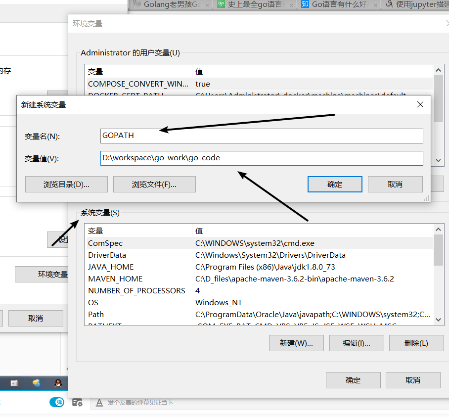
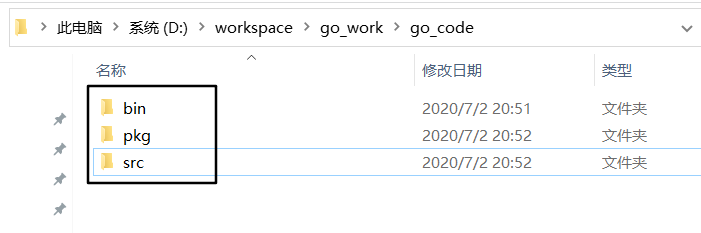
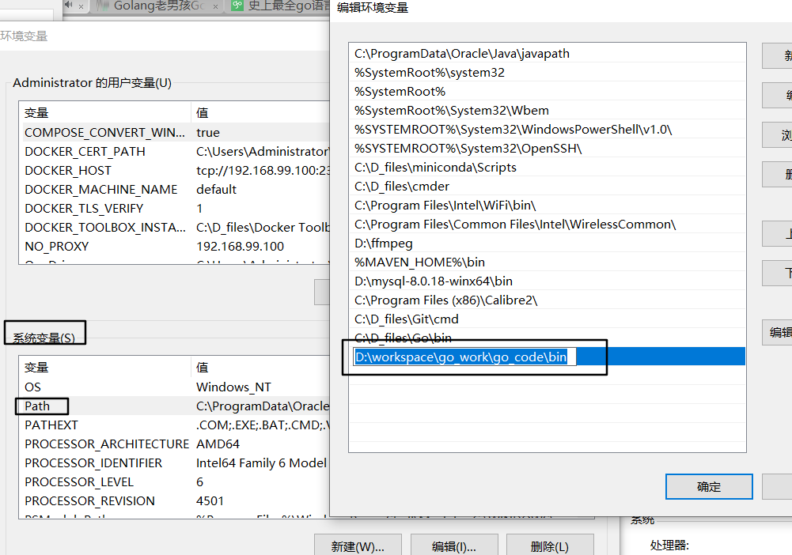

Golang

[toc]

## 基本信息

+ docker k8s 使用go实现

+ go编译出的程序运行速度快，堪比c++，java

+ 起源2007年，09年发布 一年1-2版本

+ go1.5 去除c语言部分，使用go编译go

+ go1.8 gc性能大幅提升

+ 新版本对下兼容

+ 编译型静态语言，感官上有像解释型语言

+ 并发编程，并发执行的单元为goroutine协程

  

## 安装与配置

### [获取安装包](https://golang.google.cn/dl/)

### 环境变量

自己新建一个目录，将用存储自己的代码，然后设置到系统环境变量中，去除用户环境中的GOPATH



在新建的环境目录中新建三个目录

bin，pkg，src

并将bin的路径添加到环境变量的path中






### 测试

使用命令行中使用``go env`` 可以查看到go相关的环境变量

## 项目结构

通常把代码放置于src之下；

GOPATH   bin  编译后的二进制文件

 				 pkg 编译后的库文件

​				  src  源文件

​							code.testwork.com

​									test1

## Go开发编辑器

### vscode [下载](https://vscode.en.softonic.com/)

#### 安装中文插件


#### 安装go插件		


#### 修改字体大小

​			文件/设置/首选项/  搜索 fontsize|save


#### 修改默认终端：

 ctrl+shift+p打开命令面板，输入select ，选中Terminal:Select Default Shell 

项目下编译 ``go build``，生成go的exe版本，运行exe文件名即可

## 换源：

#### 七牛云

```bash
go env -w GO111MODULE=on
go env -w GOPROXY=https://goproxy.cn,direct
```

#### 阿里源：

```bash
go env -w GO111MODULE=on
go env -w GOPROXY=https://mirrors.aliyun.com/goproxy/,direct
```

##### 取消设置：

```
unset GOPROXY
```

