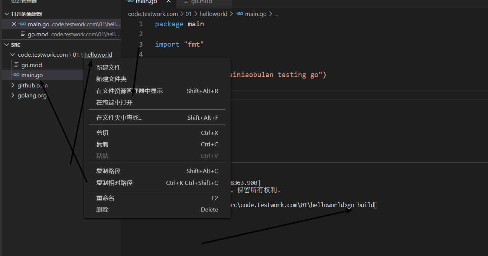
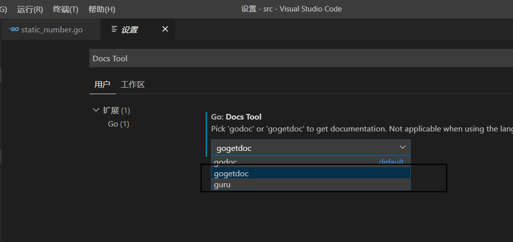

# 开始之路

[toc]

## go的基本编码规范

### 简单的go文件格式

> main.go

````go
package main
//package 为main时，可以被编译成一个可执行的文件，同时要求，必须有一个main函数，无参无返
// package 必须要有

import "fmt"
/*
导包,包名使用引号包裹
只能定义一些变量声明，标识符，类型，常量，函数
不可书写逻辑操作
*/
func main(){ //左大括号不支持占一行
    fmt.Println("Hello world!")//换行
    fmt.Printf("string values is : %s", s1) //占位符
    fmt.Print("print one")
}
````


当使用换源后，即使用了 go env -w GO111MODULE=on

``go build``  会失败，

因为换源所开启的go env -w GO111MODULE=on，使得go默认管理依赖的方式变成了go module模式，即依赖一个go.mod文件，其中描述了项目依赖的包和版本（类似于npm package.json，maven的pom.xml）

而目录中没有go.mod文件，所以go不知道主模块是什么，所以无法编译

```
go mod init hello //hello为主 go文件名即可
```

选择目录》终端中运行》go build



出现main.exe,终端运行main.exe即可

不编译，直接运行：

``go run main.go``

### 关键字

```go
break default func interface select
case defer go map struct
chan else goto package switch
const fallthrough if range type
continue for import return var
```


### 保留字

```go
Constants: 
		true false iota nil

Types:
		int int8 int16 int32 int64
		uint uint8 uint16 uint32 uint64 uintptr
		float32 float64 complex128 complex64
		bool byte rune string error

Functions: 
		make len cap new append copy close delete
		complex real imag
		painc recover
```


### 变量

go中变量名均需要事先声明类型后，才可以使用，同一作用域不支持重复定义

#### 变量的定义

+ var 变量名 类型 

```go
var n1 int
var s1 string
var s2  string = "st"
var ( //批量声明变量，可以在函数内，也可以在函数外部
    n3 int
    s3 string
)
var s4,s5 string = "q", "t"
var s6 = "w" //编译时会自动根据右边值来推测类型
s7 := "p" //简短声明，省略了var，同时根据值来推测类型，但只能用于函数之中
_, x := foo() // 匿名变量，当一个函数返回多个值，但只使用其中部分，则可以以_来接收，起到占位、忽略作用
```

**tips**：

+ 声明的变量必须被使用，否则不允许编译

  ```
  .\main.go:14:3: xx declared but not used
  ```

+ 如果声明变量，但是没有赋值，则默认为其默认的值，int类型为0，bool类型为false，string类型为“”

+ 推荐使用小驼峰命名

### 格式化go编码

```shell
go fmt main.go // 文件名
```

### 查看函数定义

vscode 使用ctrl+ 左键即可

无法使用时，切换为

 如提示需要安装软件（此能力通过go的godef模块提供的）：

 go get github.com/uudashr/gopkgs/cmd/gopkgs@latest 

### 常量

+ 以const定义，类似var声明，但是声明时，必须初始化，同时不可被修改

```go
const c1 = 123
const c2 = "qwe"
const (
	c3 = 456
    c4 = "asd"
    c5  //此时，与c4保持一致
    c6  // 与c5，c5一致
)

```

+ iota

iota在同一个const出现时被重置，同时，每声明一行常量（一行定义多个也只算一次），均会被累加一（即中间常量未继续赋值未iota，iota也会被加1，参考举例中const4）, 枚举时，可使用

```go
const(//1
	n1 = iota
    n2
)
const(//2
	n3 = iota
    n4
)

const(//3
	n5 = iota  //0
    _  //1
    n6 //2
)

const(//4
	n7 = iota  //0
    n8 = 100   //100
    n9 = iota  //2
)

const(//5
    _ = iota
    kb = 1<< 1*(10*iota)
    mb = 1<<1*(10*iota)
)

fmt.Println("iota:", n1, n2)

fmt.Println("iota:", n3, n4)
```

```
iota: 0 1
iota: 0 1
```

参考下载文件： [01.zip](./002.assets/01.zip) 

**tips**

+ 如果批量定义常量，某一个未定义值，则跟随上一个常量

### 基本数据类型

本段内容代码笔记： [static_number.go](./002.assets/static_number.go) 

#### 整形

|                | int8  | int16  | int32  | int64  |
| :------------: | ----- | ------ | ------ | ------ |
| 对应无符号整型 | uint8 | uint16 | uint32 | uint64 |

**tips**：

1. 

+ uint8 即byte

+ int16 对应c语言中的short
+ int64 对应c语言中的long

2. 特殊整型

- uint 32位系统为uint32 ，64位机为uint64

- int 32位系统为int32 ，64位机为int64

- uintptr 无符号整型，用于存放指针

3. go中无直接定义二进制数

   ```go
   //八进制及十六进制
   	var a int = 10
   	fmt.Printf("十进制打印：%d\n", a)
   	fmt.Printf("转为二进制：%b\n", a)
   	fmt.Printf("转为八进制：%o\n", a)
   	fmt.Printf("转为十六进制：%x\n", a)
   
   	i2 := 077
   	fmt.Printf("八进制转换为十进制打印： %d \n", i2)
   
   	i3 := 0X1011
   	fmt.Printf("十六进制转换为十进制打印： %d \n", i3)
   ```

   ```
   十进制打印：10
   转为二进制：1010
   转为八进制：12
   转为十六进制：a
   八进制转换为十进制打印： 63
   十六进制转换为十进制打印： 4113
   ```

#### 浮点

默认folat都是float64位的

  ```go
var f0 float32 =1.567
f1 := 1.2345
fmt.Printf("%T ", f1) //打印类型
f2 := float32(1.2344)强制转型
  ```

**tips:**

float32与float64类型数值不能直接传递

#### 复数

complex64,实部和虚部都是32位； complex128实部和虚部都是64位

````go
var c1 complex64
c1 = 1+2i
var c2 complex128
c2 = 2+3i
fmt.Println(c1, c2)
````

```
(1+2i) (2+3i)
```

#### 布尔

bool默认位false

**tips：**

禁止整型强转位bool

bool不参与数值运算，也无法转换位其他类型

````go
//bool
	var (
		b1 bool
		b2 bool = true
	)
	fmt.Println(b1, b2)
````

```
false true
```

#### 字符串

内部实现使用utf-8，只能使用双引号表示，单引号只表示字符

单一的字符，汉字，符号表示一个字符

```go
func forstring() {

	s1 := "字符串"
	s2 := 'a'
	s3 := `
	多行字符串，使用的esc之下的点，不是引号
	`
	fmt.Printf("%T,%v,%#v\n", s1, s1, s1)
	fmt.Printf("%T,%v,%#v\n", s2, s2, s2)
	fmt.Printf("%T,%v,%#v\n", s3, s3, s3)
	/*
		转义字符
		\r回车  \n换行 \t制表 tab
		\'	    \"	  \\
		常用操作
		len(str)
		+ fmt.sprintf(str1,str2) 均可拼接
		strings.Split(str1, str2),以str2来分割str1
			   .Contains(str1,str2)
			   .HasPrefix
			   .HasSuffix
			   .Index 返回字串的字符左起位置
			   .LastIndex 最后一个的位置
			   .Join()
	*/
	fmt.Println("------------------------")
	fmt.Println("拼接1", s1+s3)
	fmt.Println("拼接2", fmt.Sprint("拼接", s1, s3))
	fmt.Println("分割", strings.Split(s1, "符"))
	fmt.Println("包含", strings.Contains(s1, "符"))
	fmt.Println("前缀判断", strings.HasPrefix(s1, "字"))
	fmt.Println("后缀判断", strings.HasSuffix(s1, "串"))
	fmt.Println("查询的第一字串", strings.Index(s1, "符"))
	fmt.Println("查询的最后字串", strings.LastIndex(s1, "符"))
	fmt.Println("拼接字串", strings.Join(strings.Split(s1, "符"), "+"))
}
```

```
string,字符串,"字符串"
int32,97,97
string,
        多行字符串，使用的esc之下的点，不是引号
        ,"\n\t多行字符串，使用的esc之下的点，不是引号\n\t"
------------------------
拼接1 字符串
        多行字符串，使用的esc之下的点，不是引号

拼接2 拼接字符串
        多行字符串，使用的esc之下的点，不是引号

分割 [字 串]
包含 true
前缀判断 true
后缀判断 true
查询的第一字串 3
查询的最后字串 3
拼接字串 字+串
```

修改字符串

```go
func modystring() {
	/*
		string本身不可修改，因此需要转换为rune数组后修改完毕再转换为字符串
	*/
	s2 := "qwe"
	s3 := []rune(s2)
	s3[0] = 'T'
	fmt.Println(string(s3))
}
```

```
Twe
```


#### byte,rune

即字符型，打印类型为uint8

如果一个字符无法用ascii表示，则其类型为rune，打印类型为int32

```go
func forbyte() {
	s := "test_你好word"
	/*go 中无法转换位ascii码类型的字符，定义为rune类型，
		如汉字或其他语言特殊符号等
		其实际为int32类型
		*/
		for a, c := range s {
		fmt.Printf("%#v:%c,and type is %T\n", a, c, c)
	}
}
```

```
0:t,and type is int32
1:e,and type is int32
2:s,and type is int32
3:t,and type is int32
4:_,and type is int32
5:你,and type is int32
8:好,and type is int32
11:w,and type is int32
12:o,and type is int32
13:r,and type is int32
14:d,and type is int32
```

#### 小demo

```go
func countchinese() {//统计汉字数量
	str := "hello,你好"
	var count int
	for _, w := range str {
		if unicode.Is(unicode.Han, w) {
			count++
		}
	}
	fmt.Println("count:", count)
}
```


## fmt 模块使用

```go
func forfmt() {
	s := "asc"

	fmt.Println("打印时默认带换行", s)
	fmt.Print("只打印，无换行", s)

	fmt.Printf("带格式打印%s", s)
	/*
	%T,取参数类型，
	%d参数转换位十进制，
	%o转八进制
	%x转十六进制
	%b 转二进制
	%v 只取值
	%s string类型占位
	%c 字符
	*/

}
```

