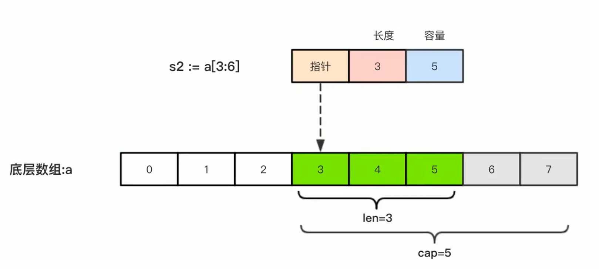
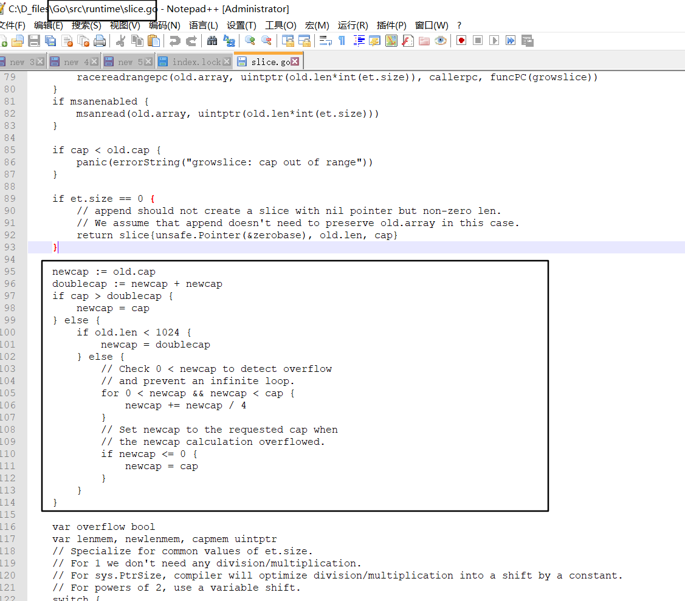

# 流程控制

本节笔记代码[forcontrol.go](./003.assets/forcontrol.go) 

## 判断 if

判断流程格式：

``if ...else if..else`` 

```go
func forif() {
	age := 19
	if age > 18 {
		fmt.Printf("lucky ,Ur age is %d", age)
	} else if age > 15 {
		fmt.Print("U can listen to the music")
	} else {
		fmt.Println("sorry, Ur so younger")
	}
}
```

+ 

## 循环

go中只有``for``，没有while，do while等

使用``break``跳出循环，使用``continue``则直接进行下一次循环

```go
func forfor() {
	// 格式1
	for i := 0; i < 3; i++ {
		fmt.Println(i)
		if i==1:{
			continue
		}
		if i ==2:{
		break}
	}
	fmt.Println("==============")
	//格式2,初始参数可以不定义在for中
	var i = 5
	for ; i < 10; i++ {
		fmt.Println(i)
	}

	//格式3，变更省略
	for i < 10 {
		fmt.Println(i)
		i++
	}

	//格式4 省略，死循环
	// for {
	// 	fmt.("for run !")
	// }

	// for range 对数字，字符串切片等适用
	for _, v := range "bei京" {
		fmt.Printf("%c\n", v)
	}

}
```


## 分支 

### switch

```go
func forswitch() {
	n := 5
	switch n {
	case 1, 2:
		fmt.Println("get one")
	case 5:
		fmt.Println("get five")
	default:
		fmt.Println("get nothing")
	}

	switch { // 加逻辑判断
	case n > 3 && n < 15:
		fmt.Println("n is get in 3-4")
	}
    
	t := 1
	switch t {
	case 1:
		fmt.Println(n)
		fallthrough
	case 2:
		fmt.Println("w")
	default:
		fmt.Println("nothin")

	}

}
```

**tips**

``fallthrough``,如果一个``case``中有``fallthrough``时，此``case``运行后，还会继续运行下一个``case``，为兼容c语言设计  
	1.其下为``default``，那么就运行``default``，  
	2.当其为最后一个时，会报错   

## goto

例如再双循环中，``break``只能跳出当前for循环，上一层循环依旧需要指定状态值才能跳出，goto则可以直接跳出

```go
func forgoto() {
	p := 12
	if p > 10 {
		goto gototag
	}
gototag:
	fmt.Println("do something")

	for i := 0; i < p; i++ {
		for j := 0; j < 10; j++ {
			if i > 3 && j == 5 {
				goto gototag2
			}
		}
		fmt.Println(i)
	}
gototag2:
	fmt.Println("wer")
}

```

```
1
2
3
wer
```

# 运算符

## 算数运算符

```go
+ - * / %
```

```go
++ //a++ a = a+1 不存在++a 
-- // a-- a=a-1
```


## 关系运算符

```go
== != > < >= <=
```


## 逻辑运算符

```go
&& || !
```


## 位运算符

```go
& 位与 11>1 10>0 00>0
| 位或 11>1 00>0 10>1
^ 异  1^0 -> 1  00>0 11>0 
<< 左移 乘2   //注意不要超过本身类型的长度
>> 右移 除以2
```


## 赋值运算符

```go
=
+= -= *= /= %=
<<= >>=
&= ^= |=
```

## 其他运算符

```go
& 变量存储地址
* 指针变量
```


## 优先级

有些运算符拥有较高的优先级，二元运算符的运算方向均是从左至右。下表列出了所有运算符以及它们的优先级，由上至下代表优先级由高到低：

| 优先级 | 运算符           |
| :----- | :--------------- |
| 5      | * / % << >> & &^ |
| 4      | + - \| ^         |
| 3      | == != < <= > >=  |
| 2      | &&               |
| 1      | \|\|             |

# 复合类型

## 数组

数组是值类型，非引用类型，切记此点。

定义格式：var name [lenth]type

数组的类型并非只是说其中包含的数据类型，还包括它的长度，如下打印可见：

```go
func Forarray() {
	var a [12]byte
	a[1] = 'b'
	fmt.Printf("类型为：%T", a)
}
>>类型为：[12]uint8
```


数组的基本使用：

```go
// Forarray is for array test work
func Forarray() {
	var a [12]byte
	a[1] = 'b'
	fmt.Printf("类型为：%T\n", a)

	fmt.Println("初始化")
	var a1 [3]bool = [3]bool{true, true}
	fmt.Println("初始化只给一部分值：", a1)
	a2 := [...]int{1, 2, 3, 4}
	fmt.Println("初始化自动统计填写多少", a2)
	a3 := [5]int{0: 1, 4: 2}
	fmt.Println("初始化，使用索引指定值", a3)

	//遍历
	for i := 0; i < len(a3); i++ {
		fmt.Printf("切片遍历：%v ", a3[i])
	}
	fmt.Println("")
	for _, i := range a3 {
		fmt.Printf("range遍历: %v ", i)
	}
	fmt.Println("")
	//多为数组
	var a4 [3][2]int //一共是三个列表，每个列表内嵌两个列表
	a4 = [3][2]int{
		[2]int{1, 2}, [2]int{3, 4}, [2]int{5, 6},
	}
	fmt.Println("二维数组", a4)

	fmt.Println("a3", a3)
	a6 := a3
	a6[0] = 100
	fmt.Println(a3, a6)
}

```

```
类型为：[12]uint8
初始化
初始化只给一部分值： [true true false]
初始化自动统计填写多少 [1 2 3 4]
初始化，使用索引指定值 [1 0 0 0 2]
切片遍历：1 切片遍历：0 切片遍历：0 切片遍历：0 切片遍历：2
range遍历: 1 range遍历: 0 range遍历: 0 range遍历: 0 range遍历: 2
二维数组 [[1 2] [3 4] [5 6]]
a3 [1 0 0 0 2]
[1 0 0 0 2] [100 0 0 0 2]
```

**tips:**  

+ 需要注意的是，数值的长度一旦被确定，便无法被修改

+ 数组是值类型的，即都是深拷贝的，这一点与其他语言要区分开来，其它语言中数组是引用类型

```go
a3 := [5]int{0: 1, 4: 2}
fmt.Println("a3", a3)
	a6 := a3
	a6[0] = 100
	fmt.Println(a3, a6)
```

```
[1 0 0 0 2] [100 0 0 0 2]
```

**tips**

+ 数组支持== != 操作，原因也在于其为值类型，而非引用类型

## 切片

slice 是拥有同类型元素可变长度的序列，是对数组类型的一种封装，为引用类型。内部结构包含地址、长度、容量

长度为其内部元素的个数，``len()``可查

容量则为其最底层数组来源的长度切片的起始位置到最后的长度

如，list a :[1,2,3,4,5]

slice s = a[1:3]// [2,3]len(s) :2,cap(s):4

slice s2 = s[1]// [2],len(s2):1,cap(s2):3 ，因为其来源于数组a

### 列表创建切片

```go
//定义
	var s1 []int
	fmt.Println("s1 未赋值与空的对比：", s1 == nil)
	s1 = []int{12}
	fmt.Println("切片：", s1)
	fmt.Println("s1 赋值后与空的对比：", s1 == nil)
	s1 = []int{14, 23, 45}
	fmt.Println("重新赋值：", s1)
	fmt.Println("切片长度：", len(s1))
	fmt.Println("切片容量", cap(s1))

	//从数组中获取切片
	a1 := [...]int{1, 2, 3, 4, 5}
	s2 := a1[0:3] //a1[:3],a1[0:],a1[:]
	fmt.Println("切片s2：", s2)
	fmt.Println("切片长度：", len(s2))
	fmt.Println("切片容量", cap(s2))

	//对切片的切片
	s3 := s2[1:]
	fmt.Println("切片s3：", s3)
	fmt.Println("切片长度：", len(s3))
	fmt.Println("切片容量", cap(s3))
```

```go
s1 未赋值与空的对比： true
切片： [12]
s1 赋值后与空的对比： false
重新赋值： [14 23 45]
切片长度： 3
切片容量 3
切片s2： [1 2 3]
切片长度： 3
切片容量 5
切片s3： [2 3]
切片长度： 2
切片容量 4
```

**tips：**

+ 如果slice的数据来源为一个即时生成的，那么也是一样的过程，只是这个数组是隐式的存储与缓存中的

+ slice 的数据结构为，指针 长度 容量，即标志数据来源的起始位置，要取多少，以及从起始位置一共可以取到多少



### make创建切片

```go
s4 := make([]int, 5, 10) //类型，len,cap,
	fmt.Printf("s4=%v len(s4)=%d cap(s4)=%d\n", s4, len(s4), cap(s3))

```

```
s4=[0 0 0 0 0] len(s4)=5 cap(s4)=4
```


**tips**

+ len设置为0，则值为空

### 切片扩容

使用append对切片进行扩容，必须覆盖回原切片

```go
//切片扩容
	s4 = append(s4, 6)//s4:[0 0 0 0 0]
//s4 = append(s4, 6，1，2，3)
//s4 = append(s4,s5...) //s5为一个切片，其后追加...，意为将其解包为一个个单独的元素
fmt.Println(s4)// len:6 cap： 10
```

**tips**

+ 修改底层数组

+ 库容后，原本的空间不足，必须重新申请空间，因此，需要计算所需要的容量

  cap为old+扩容的部分

  ```go
  	newcap := old.cap
  	doublecap := newcap + newcap
  	if cap > doublecap {
  		newcap = cap
  	} else {
  		if old.len < 1024 {
  			newcap = doublecap
  		} else {
  			// Check 0 < newcap to detect overflow
  			// and prevent an infinite loop.
  			for 0 < newcap && newcap < cap {
  				newcap += newcap / 4
  			}
  			// Set newcap to the requested cap when
  			// the newcap calculation overflowed.
  			if newcap <= 0 {
  				newcap = cap
  			}
  		}
  	}
  ```

  

### 切片拷贝

copy(dst,src),深拷贝，取消引用关系

### 切片删除

切片没有删除方法，只能依靠切片来实现

如，删除索引2的元素

```go
a = append(a[:2],a[3:]...)
```

**tips**

+ 删除操作修改变更原数组信息，因为切片相当于是一片连续的空间，删除这种操作时，相当于把数据插入到dst的之后，原数组会被变更。

